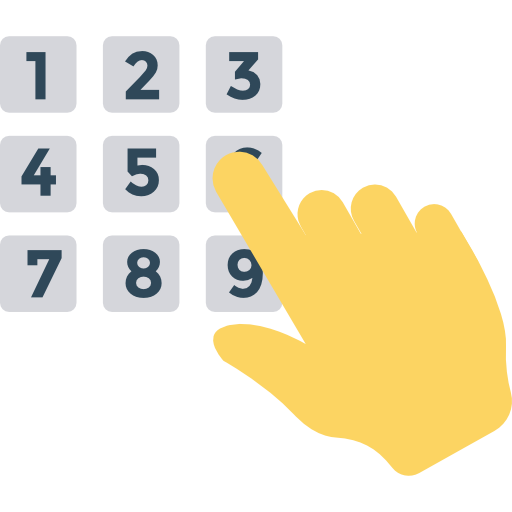
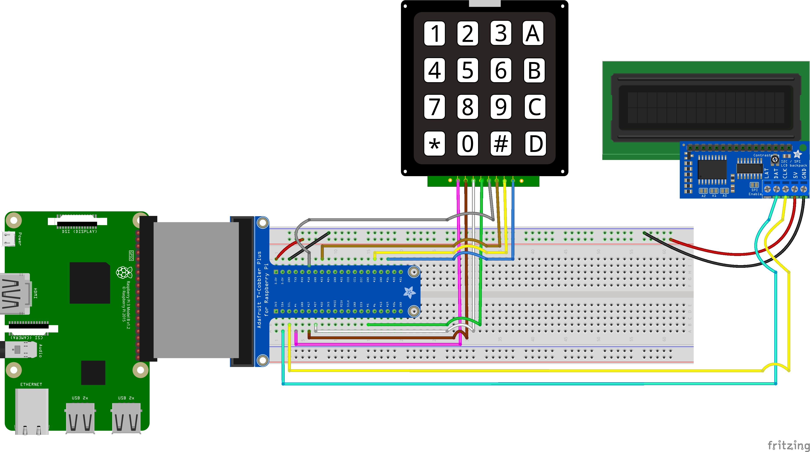

# RPI 3B Digital Library #

    
    

### User enters ISBN(s) via usb barcode scanner or GPIO controlled 4x4 keypad, then a configured RPI 3B downloads the books and hosts the files on a web server. ###

#### STEP 1 - Enter ISBN(s) via keypad or scanner ####
#### STEP 2 - Download book(s) ####
-  parses through annas-archive.org for available downloads.
- Downloads books from libgen.li and library.lol.
#### STEP 3 - Update html to include new books ####

## Diagram ##

<a href="https://www.flaticon.com/free-icons/books" title="books icons">Books icons created by popo2021 - Flaticon</a>
 
<a href="https://www.flaticon.com/free-icons/barcode-scanner" title="barcode scanner icons">Barcode scanner icons created by Freepik - Flaticon</a>
 
<a href="https://www.flaticon.com/free-icons/keypad" title="keypad icons">Keypad icons created by DinosoftLabs - Flaticon</a>